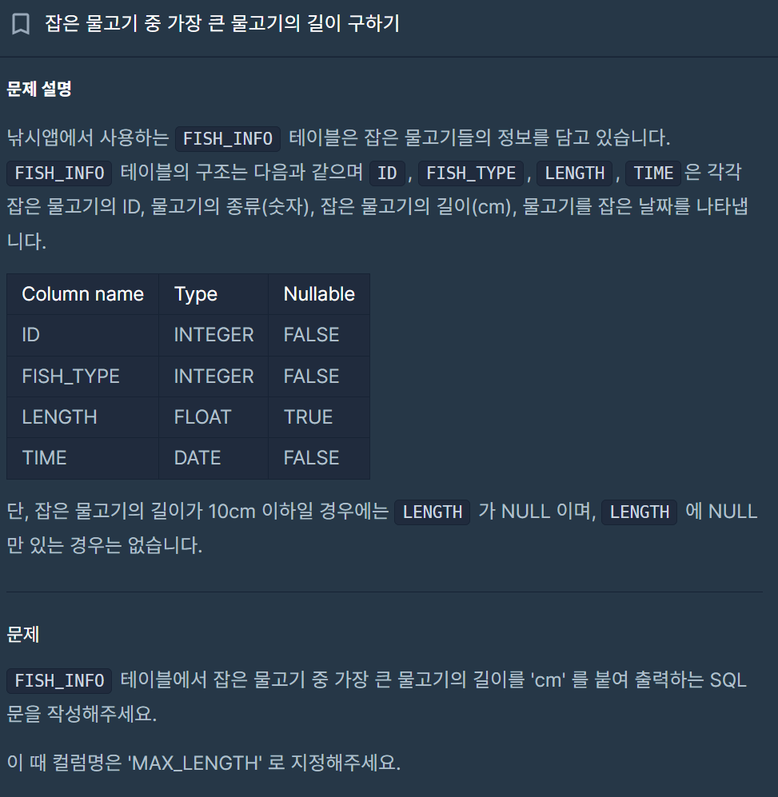

# 1. 잡은 물고기 중 가장 큰 물고기의 길이 구하기
## 날짜 : 1.12


### 코드

```
select

concat(max(LENGTH), 'cm')
as MAX_LENGTH

from FISH_INFO

where LENGTH > 10;
```


### 풀이과정

1. 'FISH_INFO' 테이블에서 잡은 물고기 중 가장 큰 물고기의 길이를 출력한다.

> MAX(LENGTH)

2. 출력되는 값에 'cm'를 붙여 출력되도록 한다.

> concat() 함수를 이용한다.

    즉, concat(MAX(LENGTH))가 되는 것~!

3. 이렇게 구한 값을 최종적으로 'MAX_LENGTH'라는 칼럼으로 저장한다.

> select as * from * 이용

    select 
    concat(MAX(LENGTH)) 
    as MAX_LENGTH
    from FISH_INFO

4. '단 조건'으로 길이가 10cm 이하인 경우 NULL로 인식하므로, 값을 나타낼 수 있으려면 10cm보다 커야한다.

> where LENGTH > 10;

### 최종 VER
```
 select 
    concat(MAX(LENGTH)) 
    as MAX_LENGTH
from FISH_INFO
where LENGTH > 10;
```

# 2. 잡은 물고기의 평균 길이 구하기

## 날짜 : 1.13


### 코드

```
select

round(avg(case when 
LENGTH is null then 10 
else LENGTH
END), 2) as AVERAGE_LENGTH

from FISH_INFO
```
### 풀이과정

1. 잡은 물고기의 평균 값을 출력한다.

> AVG(LENGTH)

2. 구한 평균 길이는 소수점 3째 자리에서 반올림하여 둘째 자리까지 나타낸다.

> ROUND(AVG(LENGTH), 2)

3. 최종적인 칼럼명을 'AVERAGE_LENGTH'로 한다.

> 
    select 
        ROUND(AVG(LENGTH), 2) as AVERAGE_LENGTH
    from FISH_INFO

4. 10cm 이하의 물고기들은 10cm로 취급한다. -> length 자리에 plug in~

> 
    case when LENGTH is null then 10
        else LENGTH
        END

### 최종 VER
```
 select 
    round(avg(case when LENGTH is null then 10
        else LENGTH
        END), 2)
    as MAX_LENGTH
from FISH_INFO
```

# 3-A. 특정 옵션이 포함된 자동차 리스트 구하기


### 코드

```
SELECT
*
from CAR_RENTAL_COMPANY_CAR
where OPTIONS LIKE "%네비게이션%"
ORDER BY
CAR_ID DESC;
```
### 궁금했던 점
- like랑 in이랑 제대로 된 구분이 필요하다.
- in 의 경우 


# 3-B. 대여 횟수가 많은 자동차들의 월별 대여 횟수 구하기

## 날짜 : 1.14

```
SELECT
  MONTH(START_DATE) AS MONTH,
  CAR_ID,
  COUNT(*) AS RECORDS
FROM
  CAR_RENTAL_COMPANY_RENTAL_HISTORY
WHERE
  CAR_ID IN (
    SELECT CAR_ID
    FROM CAR_RENTAL_COMPANY_RENTAL_HISTORY
    WHERE START_DATE BETWEEN '2022-08-01' AND '2022-10-31'
    GROUP BY CAR_ID
    HAVING COUNT(*) >= 5
  )
  AND START_DATE BETWEEN '2022-08-01' AND '2022-10-31'
GROUP BY
  MONTH(START_DATE),
  CAR_ID
HAVING
  COUNT(*) > 0
ORDER BY
  MONTH(START_DATE) ASC,
  CAR_ID DESC;
  ```

  필사했습니다... 죄송해엽.... 더 공부하겠습니다..ㅎㅎㅎ

  