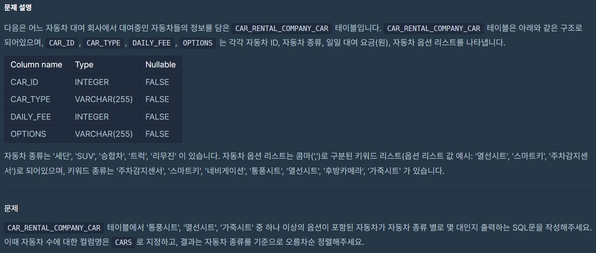

> # 2. 자동차 종류 별 특정 옵션이 포함된 자동차 수 구하기 
## lv2. (Group by)
## 날짜 : 1/18(SAT)
### 문제 링크 : [프로그래머스](https://school.programmers.co.kr/learn/courses/30/lessons/151137)



### 최종 코드
```
SELECT
CAR_TYPE,
count(*) as CARS
from CAR_RENTAL_COMPANY_CAR
where OPTIONS like '%통풍시트%'
or OPTIONS like '%열선시트%'
or OPTIONS like '%가죽시트%'
group by CAR_TYPE
order by CAR_TYPE asc;
```

### 고민한 부분 : group by

- GROUP BY 없이 쿼리를 짰을 때,
쿼리가 전체 데이터 세트에 대해 하나의 결과만을 반환한다.
또한 CAR_TYPE이 그룹화되지 않았기 때문에, 어떤 CAR_TYPE에 대한 카운트인지 명확하지 않다.

- GROUP BY CAR_TYPE을 포함하고 있는 경우, 각기 다른 CAR_TYPE에 대해 개별적으로 카운트를 계산한다.

> 즉, 각 차종별로 몇 대의 차량이 해당 옵션을 갖고 있는지에 대한 리스트를 반환한다.


=> 따라서 집계함수와 GROUP BY를 함께 써주는 것 중요!! (다음은 지선생님 피셜~)

1) CAR_TYPE처럼 카테고리화된 데이터를 가지고 작업 시, 각 카테고리별로 데이터를 정리하고 분석하는 것이 중요함.
GROUP BY없이는 CAR_TYPE이 SELECT절에 쓰였을 때, 어떤 CAR_TYPE을 가져와야 할지 혼란스러워하며, 오류를 발생시킨다.

2) 집계함수를 통해 필요한 부분만을 요약 분석할 수 있어 작업량 감소.
