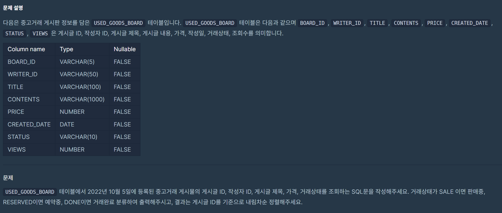

> # 1. 과일로 만든 아이스크림 고르기
## lv1. (Select)
## 날짜 : 1/17(FRI)
### 문제 링크 : [프로그래머스](https://school.programmers.co.kr/learn/courses/30/lessons/133025)


### 최종 코드
```
SELECT FH.FLAVOR
FROM FIRST_HALF FH
JOIN ICECREAM_INFO II ON FH.FLAVOR = II.FLAVOR
WHERE FH.TOTAL_ORDER > 3000 AND II.INGREDIENT_TYPE = 'fruit_based'
ORDER BY FH.TOTAL_ORDER DESC;
```
---

> # 2. 자동차 종류 별 특정 옵션이 포함된 자동차 수 구하기 
## lv2. (Group by)
## 날짜 : 1/18(SAT)
### 문제 링크 : [프로그래머스](https://school.programmers.co.kr/learn/courses/30/lessons/151137)


### 최종 코드
```
SELECT
CAR_TYPE,
count(*) as CARS
from CAR_RENTAL_COMPANY_CAR
where OPTIONS like '%통풍시트%'
or OPTIONS like '%열선시트%'
or OPTIONS like '%가죽시트%'
group by CAR_TYPE
order by CAR_TYPE asc;
```

### 고민한 부분 : group by

- GROUP BY 없이 쿼리를 짰을 때,
쿼리가 전체 데이터 세트에 대해 하나의 결과만을 반환한다.
또한 CAR_TYPE이 그룹화되지 않았기 때문에, 어떤 CAR_TYPE에 대한 카운트인지 명확하지 않다.

- GROUP BY CAR_TYPE을 포함하고 있는 경우, 각기 다른 CAR_TYPE에 대해 개별적으로 카운트를 계산한다.

> 즉, 각 차종별로 몇 대의 차량이 해당 옵션을 갖고 있는지에 대한 리스트를 반환한다.


=> 따라서 집계함수와 GROUP BY를 함께 써주는 것 중요!! (다음은 지선생님 피셜~)

1) CAR_TYPE처럼 카테고리화된 데이터를 가지고 작업 시, 각 카테고리별로 데이터를 정리하고 분석하는 것이 중요함.
GROUP BY없이는 CAR_TYPE이 SELECT절에 쓰였을 때, 어떤 CAR_TYPE을 가져와야 할지 혼란스러워하며, 오류를 발생시킨다.

2) 집계함수를 통해 필요한 부분만을 요약 분석할 수 있어 작업량 감소.

---

> # 3. 가장 큰 물고기 10마리 구하기
## lv1. (Select)
## 날짜 : 1/19(SUN)
### 문제 링크 : [프로그래머스](https://school.programmers.co.kr/learn/courses/30/lessons/298517)


### 최종 코드
```
select
ID,
LENGTH
from FISH_INFO
where LENGTH > 10
order by LENGTH desc, ID asc
limit 10;
```

---

# 4. 조건에 부합하는 중고거래 상태 조회하기
## lv2. (String, Date)
## 날짜 : 1/20(MON)
### 문제 링크 : [프로그래머스](https://school.programmers.co.kr/learn/courses/30/lessons/164672)



### 최종 코드
```
SELECT
BOARD_ID, 
WRITER_ID, 
TITLE,
PRICE,
    case 
    when STATUS = 'SALE' then '판매중'
    when STATUS = 'RESERVED' then '예약중'
    when STATUS = 'DONE' then '거래완료'
    else STATUS
    end as STATUS_STATE
from USED_GOODS_BOARD
where CREATED_DATE = '2022-10-5'
order by BOARD_ID desc;
```

# 5. 조건에 맞는 사용자와 총 거래 금액 조회하기
## lv3. (Group by)
## 날짜 : 1/21(TUE)
### 문제 링크 : [프로그래머스](https://school.programmers.co.kr/learn/courses/30/lessons/164668)


### 최종 코드
```
SELECT 
    U.USER_ID, 
    U.NICKNAME, 
    SUM(B.PRICE) AS TOTAL_AMOUNT
FROM 
    USED_GOODS_BOARD AS B
JOIN 
    USED_GOODS_USER AS U
ON 
    B.WRITER_ID = U.USER_ID
WHERE 
    B.STATUS = 'DONE'
GROUP BY 
    U.USER_ID, U.NICKNAME
HAVING 
    SUM(B.PRICE) >= 700000
ORDER BY 
    TOTAL_AMOUNT ASC;
```

### 궁금했던 점

```
GROUP BY 
    U.USER_ID, U.NICKNAME
```
이부분에서 왜 group by해서 nickname까지 들어갔는지...
살짝 필사..ㅋㅋ

---

