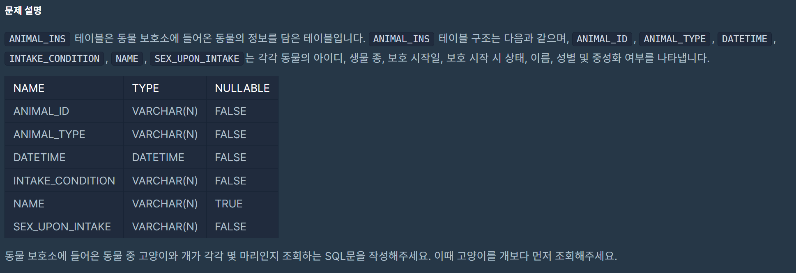

# 1. 최솟값 구하기
## lv2
## 날짜 : 1/24(FRI)
### 문제 링크 : [프로그래머스](https://school.programmers.co.kr/learn/courses/30/lessons/59038)


### 최종 코드
```
SELECT
DATETIME as '시간'
from ANIMAL_INS
order by DATETIME asc
limit 1;
```

# 2. 동명 동물 수 찾기
## lv2
## 날짜 : 1/24(FRI)
### 문제 링크 : [프로그래머스](https://school.programmers.co.kr/learn/courses/30/lessons/59041)


### 최종 코드
```
SELECT
NAME,
COUNT(NAME) AS COUNT
from ANIMAL_INS
GROUP BY NAME
HAVING COUNT(NAME) >= 2
ORDER BY NAME ASC;
```

### 계속 틀렸던 부분
1. COUNT(NAME)이 아니라 COUNT(ANIMAL_ID)로 시도

    1-1. 아무래도 우리가 구하는 건 NAME의 COUNT였으니까 정정해주는 게 맞긴 해해
2. HAVING COUNT >= 2 라고 썼었다...

    2-1. 그게 아니라 HAVING에서는 ALIAS가 아니라 직접적인 함수로 써줘야한다는 사실을 막판에 깨달았다!

3. ORDER BY의 경우 HAVING 뒤에 최종적으로 써야한다.

# 3. 동물 수 구하기
## lv2
## 날짜 : 1/24(FRI)
### 문제 링크 : [프로그래머스](https://school.programmers.co.kr/learn/courses/30/lessons/59406)


### 최종 코드
```
SELECT
COUNT(ANIMAL_ID) AS CNT
FROM ANIMAL_INS
```

# 4. 중복 제거하기
## lv2
## 날짜 : 1/24(FRI)
### 문제 링크 : [프로그래머스](https://school.programmers.co.kr/learn/courses/30/lessons/59408)


### 최종 코드
```
SELECT
COUNT(DISTINCT(NAME)) AS count
FROM ANIMAL_INS
```

# 5. 이름에 el이 들어가는 동물 찾기
## lv2
## 날짜 : 1/24(FRI)
### 문제 링크 : [프로그래머스](https://school.programmers.co.kr/learn/courses/30/lessons/59047)


### 최종 코드
```
SELECT
ANIMAL_ID,
NAME
FROM ANIMAL_INS
WHERE NAME LIKE '%el%'
AND ANIMAL_TYPE	= 'Dog'
ORDER BY NAME;
```

### 대소문자 구분 없애기 위한 엄밀한 코드(LOWER/UPPER 활용하기!)
```
SELECT
ANIMAL_ID,
NAME
FROM ANIMAL_INS
WHERE LOWER(NAME) LIKE '%el%'
AND ANIMAL_TYPE	= 'Dog'
ORDER BY NAME
```

# 6. NULL 처리하기
## lv2
## 날짜 : 1/24(FRI)
### 문제 링크 : [프로그래머스](https://school.programmers.co.kr/learn/courses/30/lessons/59410)


### 최종 코드
```
SELECT
ANIMAL_TYPE,
ifnull(NAME, 'No name'),
SEX_UPON_INTAKE
FROM ANIMAL_INS
ORDER BY ANIMAL_ID;
```


# 7. DATETIME에서 DATE로 형 변환
## lv2
## 날짜 : 1/25(SAT)
### 문제 링크 : [프로그래머스](https://school.programmers.co.kr/learn/courses/30/lessons/59414#fn1)


### 최종 코드
```
SELECT
ANIMAL_ID,
NAME,
SUBSTR(DATETIME, 1, 10) AS '날짜'
FROM ANIMAL_INS
ORDER BY ANIMAL_ID;
```

### 시도했었던 코드
```
SELECT
ANIMAL_ID,
NAME,
DATE(DATETIME) AS 날짜
FROM ANIMAL_INS
ORDER BY ANIMAL_ID;
```
위 코드처럼 시도했을 때 계속 틀림..
근데 출력되는 게 날짜만 출력이 아니라 시간 부분도 출력돼서 00 ;00 ;00 막 이랬삼.

-> DATE 함수를 이용해준 게 아니라 SUBSTR 함수 이용해서 직접적으로 일부만 나타내도록 설정했더니 정답처리됐음..허허허


# 8. 가격이 제일 비싼 식품의 정보 출력하기
## lv2
## 날짜 : 1/25(SAT)
### 문제 링크 : [프로그래머스](https://school.programmers.co.kr/learn/courses/30/lessons/131115)


### 최종 코드
```
SELECT
*
FROM FOOD_PRODUCT
ORDER BY PRICE DESC
LIMIT 1;
```


# 9. 조건에 맞는 아이템들의 가격의 총합 구하기
## lv2
## 날짜 : 1/25(SAT)
### 문제 링크 : [프로그래머스](https://school.programmers.co.kr/learn/courses/30/lessons/273709)


### 최종 코드
```
SELECT
SUM(PRICE) AS TOTAL_PRICE
FROM ITEM_INFO
WHERE RARITY="LEGEND";
```


# 10. 카테고리 별 상품 개수 구하기
## lv2
## 날짜 : 1/25(SAT)
### 문제 링크 : [프로그래머스](https://school.programmers.co.kr/learn/courses/30/lessons/131529)


### 최종 코드
```
SELECT
SUBSTR(PRODUCT_CODE, 1, 2) AS CATEGORY,
COUNT(PRODUCT_ID) AS PRODUCTS
FROM PRODUCT
GROUP BY CATEGORY
ORDER BY PRODUCT_CODE ASC;
```


# 11. 진료과별 총 예약 횟수 출력하기
## lv2
## 날짜 : 1/26(SUN)
### 문제 링크 : [프로그래머스](https://school.programmers.co.kr/learn/courses/30/lessons/132202)


### 최종 코드
```

```


### 시도했었던 코드
```
SELECT
SUBSTR(MCDP_CD, 1, 2) AS '진료과 코드',
COUNT(*) AS '5월예약건수'
FROM APPOINTMENT
WHERE DATE(APNT_YMD) LIKE '2022-05-%'
GROUP BY SUBSTR(MCDP_CD, 1, 2)
ORDER BY COUNT(*) ASC, SUBSTR(MCDP_CD, 1, 2) ASC;
```

> WHERE APNT_YMD BETWEEN '2022-05-01' AND '2022-05-31'


# 12. 고양이와 개는 몇 마리 있을까
## lv2
## 날짜 : 1/26(SUN)
### 문제 링크 : [프로그래머스](https://school.programmers.co.kr/learn/courses/30/lessons/59040)



### 최종 코드
```
SELECT
ANIMAL_TYPE,
COUNT(ANIMAL_TYPE) AS count
FROM ANIMAL_INS
WHERE ANIMAL_TYPE = 'Cat' OR ANIMAL_TYPE = 'Dog'
GROUP BY ANIMAL_TYPE
ORDER BY
    CASE WHEN ANIMAL_TYPE = 'Cat' THEN 1 ELSE 2 END;
```
### 참고로 ORDER BY 부분의 경우, 다음처럼 쓸 수도 있답니다..!
```
> ORDER BY
    CASE WHEN ANIMAL_TYPE = 'Cat' THEN 1 ELSE 2 END ASC

다음과 같이 ASC를 명시적으로 코드에 작성해줘도 가능!
근데 차피 ORDER BY의 기본은 ASC라서 상관은 없삼~!

> ORDER BY 
    CASE 
        WHEN ANIMAL_TYPE = 'Cat' THEN 1 
        WHEN ANIMAL_TYPE = 'Dog' THEN 2
        ELSE 3 
    END;

이것처럼 직접적으로 CAT, DOG의 순서를 명시해줘도 가능~!
```


### 시도했었던 코드
```
SELECT
ANIMAL_TYPE,
COUNT(ANIMAL_TYPE) AS count
FROM ANIMAL_INS
WHERE ANIMAL_TYPE = 'Cat' OR ANIMAL_TYPE = 'Dog'
GROUP BY ANIMAL_TYPE;
```

### 고민했던 부분
난 자연스럽게 WHERE ANIMAL_TYPE에서 'CAT'을 먼저 지정하면 자연스럽게 순서 지정이 되는 줄 알았걸랑요? 근데, 명시적으로 코드를 입력해야지만 정답처리해주더라구요.. 쳇(?) 참고하셔유~


# 13. 중성화 여부 파악하기
## lv2
## 날짜 : 1/26(SUN)
### 문제 링크 : [프로그래머스](https://school.programmers.co.kr/learn/courses/30/lessons/59409)


### 최종 코드
> SOL1
```
SELECT
    ANIMAL_ID,
    NAME,
    CASE 
        WHEN SUBSTR(SEX_UPON_INTAKE, 1, 8) = 'Neutered' 
             OR SUBSTR(SEX_UPON_INTAKE, 1, 6) = 'Spayed' THEN 'O'
        ELSE 'X' 
    END AS 중성화
FROM ANIMAL_INS
ORDER BY ANIMAL_ID;
```
> SOL2
```
SELECT
    ANIMAL_ID,
    NAME,
    CASE 
        WHEN SEX_UPON_INTAKE LIKE '%Neutered%' 
             OR SEX_UPON_INTAKE LIKE '%Spayed%' THEN 'O'
        ELSE 'X' 
    END AS 중성화
FROM ANIMAL_INS
ORDER BY ANIMAL_ID;
```

코드는 맞는데, 들여쓰기가 아니라서 틀림 처리 계속 됐었어욥..ㅎ

### 참고용 코드
```
SELECT
    ANIMAL_ID,
    NAME,
    CASE 
        WHEN INSTR(SEX_UPON_INTAKE, 'Neutered') > 0 
             OR INSTR(SEX_UPON_INTAKE, 'Spayed') > 0 THEN 'O'
        ELSE 'X' 
    END AS 중성화
FROM ANIMAL_INS
ORDER BY ANIMAL_ID;
```
다음과 같이 ```INSTR```함수를 이용하면 특정 문자열이 포함되어 있는지 확인할 수 있다. 만약, 원하는 단어를 포함한다면 0보다 큰 값으로 반환된다는 특징 있음!


# 14. 입양 시각 구하기(1)
## lv2
## 날짜 : 1/26(SUN)
### 문제 링크 : [프로그래머스](https://school.programmers.co.kr/learn/courses/30/lessons/59412)


### 최종 코드
```
SELECT
SUBSTR(TIME(DATETIME), 1, 2) AS HOUR,
COUNT(ANIMAL_ID) AS COUNT
FROM ANIMAL_OUTS
WHERE SUBSTR(TIME(DATETIME), 1, 2) BETWEEN 9 AND 19
GROUP BY SUBSTR(TIME(DATETIME), 1, 2)
ORDER BY SUBSTR(TIME(DATETIME), 1, 2);
```


# 15. 조건에 맞는 도서와 저자 리스트 출력하기
## lv2
## 날짜 : 1/26(SUN)
### 문제 링크 : [프로그래머스](https://school.programmers.co.kr/learn/courses/30/lessons/144854)


### 최종 코드
```
```


# 16. 상품 별 오프라인 매출 구하기
## lv2
## 날짜 : 1/27(MON)
### 문제 링크 : [프로그래머스](https://school.programmers.co.kr/learn/courses/30/lessons/131533)


### 최종 코드
```
SELECT
P.PRODUCT_CODE, 
SUM(O.SALES_AMOUNT*P.PRICE) AS SALES
FROM PRODUCT AS P
JOIN OFFLINE_SALE AS O
ON P.PRODUCT_ID = O.PRODUCT_ID
GROUP BY P.PRODUCT_CODE
ORDER BY SUM(O.SALES_AMOUNT*P.PRICE) DESC, P.PRODUCT_CODE ASC;
```


### 시도했었던 코드
```
SELECT
P.PRODUCT_CODE, 
O.SALES_AMOUNT*P.PRICE AS SALES
FROM PRODUCT AS P
JOIN OFFLINE_SALE AS O
ON P.PRODUCT_ID = O.PRODUCT_ID
GROUP BY P.PRODUCT_CODE
HAVING SUM(O.SALES_AMOUNT*P.PRICE)
ORDER BY O.SALES_AMOUNT*P.PRICE DESC, P.PRODUCT_CODE ASC;
```

저는 SUM을 HAVING에서 따로 적용해줘야하는 줄 알았는데, 그냥 칼럼 가져올 때부터 SUM 적용해주는 게 맞더라고요..? 허허..


# 17. 성분으로 구분한 아이스크림 총 주문량
## lv2
## 날짜 : 1/27(MON)
### 문제 링크 : [프로그래머스](https://school.programmers.co.kr/learn/courses/30/lessons/133026)


### 최종 코드
```
SELECT
I.INGREDIENT_TYPE,
SUM(F.TOTAL_ORDER) AS TOTAL_ORDER
FROM FIRST_HALF AS F
INNER JOIN ICECREAM_INFO AS I
ON I.FLAVOR = F.FLAVOR
GROUP BY I.INGREDIENT_TYPE
ORDER BY TOTAL_ORDER ASC;
```


# 18. 성분으로 구분한 아이스크림 총 주문량
## lv2
## 날짜 : 1/27(MON)
### 문제 링크 : [프로그래머스](https://school.programmers.co.kr/learn/courses/30/lessons/133026)


### 최종 코드
```
SELECT
MEMBER_ID,
MEMBER_NAME,
GENDER,
SUBSTR(DATE_OF_BIRTH, 1, 10) AS DATE_OF_BIRTH
FROM MEMBER_PROFILE
WHERE TLNO IS NOT NULL AND MONTH(DATE_OF_BIRTH) = 3 AND GENDER = "W"
ORDER BY MEMBER_ID ASC;
```

# 19. 루시와 엘라 찾기
## lv2
## 날짜 : 1/27(MON)
### 문제 링크 : [프로그래머스](https://school.programmers.co.kr/learn/courses/30/lessons/59046)


### 최종 코드
```
SELECT
ANIMAL_ID,
NAME,
SEX_UPON_INTAKE
FROM ANIMAL_INS
WHERE NAME IN ('Lucy', 'Ella', 'Pickle', 'Rogan', 'Sabrina', 'Mitty')
ORDER BY ANIMAL_ID
```


# 20. 오랜 기간 보호한 동물(1)
## lv3
## 날짜 : 1/28(TUE)
### 문제 링크 : [프로그래머스](https://school.programmers.co.kr/learn/courses/30/lessons/59044)


### 최종 코드
```

```