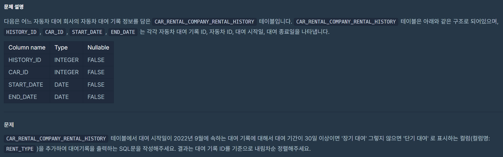
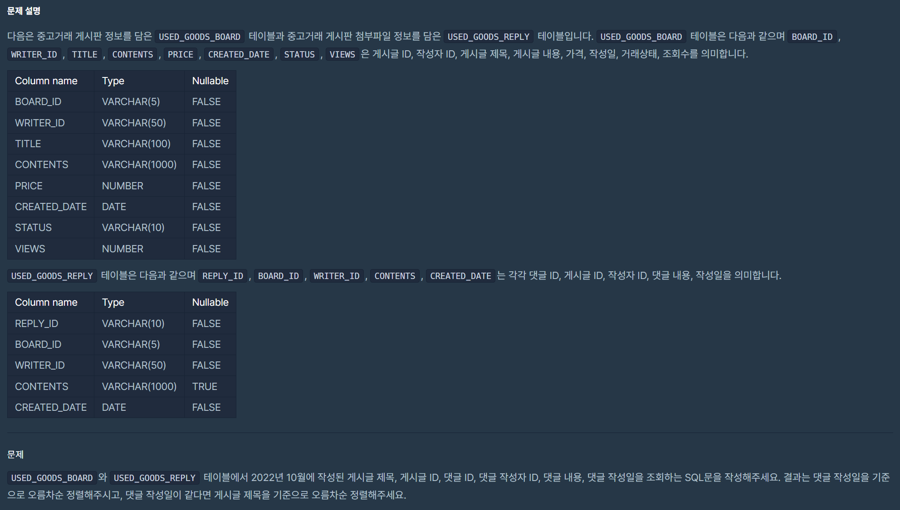
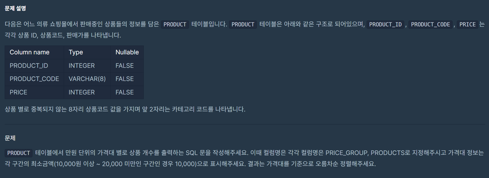
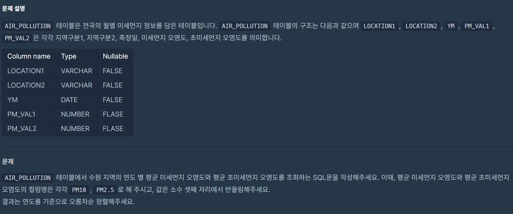
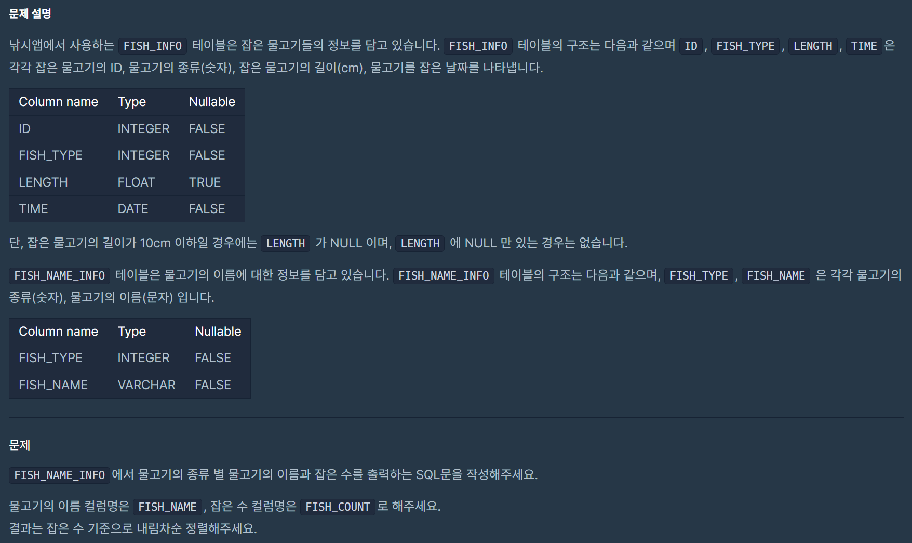
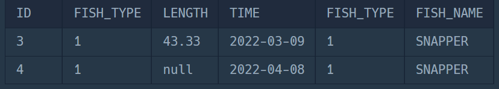

# 1. 자동차 대여 기록에서 장기/단기 대여 구분하기
## lv1
## 날짜 : 2/1(SAT)
### 문제 링크 : [프로그래머스](https://school.programmers.co.kr/learn/courses/30/lessons/151138)



### 최종 코드
```
SELECT
HISTORY_ID,
CAR_ID,
DATE_FORMAT(START_DATE, '%Y-%m-%d') AS START_DATE,
DATE_FORMAT(END_DATE, '%Y-%m-%d') AS END_DATE,
CASE WHEN
DATEDIFF(END_DATE, START_DATE)+1 >= 30 THEN '장기 대여' 
ELSE '단기 대여' END AS RENT_TYPE
FROM CAR_RENTAL_COMPANY_RENTAL_HISTORY
HAVING START_DATE LIKE '2022-09%'
ORDER BY HISTORY_ID DESC
```

### 참고용 코드(1)
```
SELECT
HISTORY_ID,
CAR_ID,
DATE_FORMAT(START_DATE, '%Y-%m-%d') AS START_DATE,
DATE_FORMAT(END_DATE, '%Y-%m-%d') AS END_DATE,
CASE WHEN
DATEDIFF(END_DATE, START_DATE)+1 >= 30 THEN '장기 대여' 
ELSE '단기 대여' END AS RENT_TYPE
FROM CAR_RENTAL_COMPANY_RENTAL_HISTORY
WHERE START_DATE LIKE '2022-09%'
ORDER BY HISTORY_ID DESC
```

### 참고용 코드(2)
```
WHERE START_DATE BETWEEN '2022-09-01' AND '2022-09-30'
```

결정적으로 ```DATEDIFF(END_DATE, START_DATE)+1 >= 30``` <- 요거 힘들었어요..


# 2. 조건에 부합하는 중고거래 댓글 조회하기 ( 아놔 이거 왜 자꾸 틀림...!!!!!!!!!)
## lv1
## 날짜 : 2/1(SAT)
### 문제 링크 : [프로그래머스](https://school.programmers.co.kr/learn/courses/30/lessons/164673)



### 최종 코드
```
SELECT
    B.TITLE,
    B.BOARD_ID,
    R.REPLY_ID,
    R.WRITER_ID,
    R.CONTENTS,
    DATE_FORMAT(R.CREATED_DATE, '%Y-%m-%d') AS CREATED_DATE
FROM USED_GOODS_BOARD AS B
INNER JOIN USED_GOODS_REPLY AS R
ON B.BOARD_ID = R.BOARD_ID
WHERE B.CREATED_DATE LIKE "2022-10%"
ORDER BY R.CREATED_DATE ASC, B.TITLE ASC;
```


### 시도했었던 코드
```
SELECT
    B.TITLE,
    B.BOARD_ID,
    R.REPLY_ID,
    R.WRITER_ID,
    R.CONTENTS,
    DATE_FORMAT(R.CREATED_DATE, '%Y-%m-%d') AS CREATED_DATE
FROM USED_GOODS_BOARD AS B
JOIN USED_GOODS_REPLY AS R
ON B.BOARD_ID = R.BOARD_ID
WHERE B.CREATED_DATE BETWEEN '2022-10-01' AND '2022-10-31'
AND R.CREATED_DATE BETWEEN '2022-10-01' AND '2022-10-31'
ORDER BY R.CREATED_DATE ASC, B.TITLE ASC;
```
WHERE
>> B.CREATED_DATE LIKE "2022-10%" AND R.CREATED_DATE LIKE "2022-10%"
>> DATE_FORMAT(B.CREATED_DATE, "%Y-%m") = "2022-10"


### 궁금한 점
문제에서 물어본 건 USED_GOODS_BOARD와 USED_GOODS_REPLY 테이블에서 2022년 10월에 작성 어쩌구인데, 
왜 코드 상에서는 B.CREATED_DATE에 대해서만 필터링해야만 정답 처리가 되는 건지..
물론 INNER JOIN(JOIN)하면 자연스럽게 맞게 필터링이 되겠지만 그래도 틀리는 건.. 아무래도 맘에 안드네욥...
참고로 결과는 똑같답니다...(LV1부터 이래서 때려치울뻔..^^)


# 3. 가격대 별 상품 개수 구하기
## lv2
## 날짜 : 2/1(SAT)
### 문제 링크 : [프로그래머스](https://school.programmers.co.kr/learn/courses/30/lessons/131530)



### 최종 코드
```
SELECT
SUBSTR(PRICE, 1, 1)*10000 AS PRICE_GROUP,
COUNT(PRODUCT_ID) AS PRODUCTS
FROM PRODUCT
GROUP BY PRICE_GROUP
ORDER BY PRICE_GROUP ASC;
```

> ```FLOOR(PRICE/10000)*10000 AS PRICE_GROUP```으로 써도 되더라구요!


# 4. 연도 별 평균 미세먼지 농도 조회하기
## lv2
## 날짜 : 2/2(SUN)
### 문제 링크 : [프로그래머스](https://school.programmers.co.kr/learn/courses/30/lessons/284530)



### 최종 코드
```
SELECT
YEAR(YM) AS YEAR,
ROUND(AVG(PM_VAL1), 2) AS "PM10",
ROUND(AVG(PM_VAL2), 2) AS "PM2.5"
FROM AIR_POLLUTION
WHERE LOCATION2 = '수원'
GROUP BY YEAR
ORDER BY YEAR ASC;
```

### 궁금한 점
> ```DATE_FORMAT(YM, "%Y") AS YEAR``` <- 이렇게 쓰면 안되는 이유 PLZ


# 5. 물고기 종류 별 잡은 수 구하기
## lv2
## 날짜 : 2/2(SUN)
### 문제 링크 : [프로그래머스](https://school.programmers.co.kr/learn/courses/30/lessons/293257)



### 최종 코드
```
SELECT
COUNT(*) AS FISH_COUNT,
FISH_NAME
FROM FISH_NAME_INFO AS N
JOIN FISH_INFO AS I
ON I.FISH_TYPE = N.FISH_TYPE
GROUP BY FISH_NAME
ORDER BY FISH_COUNT DESC;
```

### 시도했었던 코드
```
SELECT
COUNT(ID) AS FISH_COUNT,
FISH_NAME
FROM FISH_NAME_INFO AS N
JOIN FISH_INFO AS I
ON I.FISH_TYPE = N.FISH_TYPE
WHERE LENGTH > 10
GROUP BY FISH_NAME
ORDER BY FISH_COUNT DESC;
```

### 궁금했었던 점(지금은 해결 완~!)

> ```WHERE LENGTH > 10``` <- 잡은 물고기의 길이가 10cm 이하일 경우에는 LENGTH 가 NULL인 걸 제거하기 위함이었는데, 오히려 제거하면 안됐나봐요..

> 프로그래머스에서 알려줬는데, 쨋든 문제에서 구하고자 하는 건 잡은 물고기의 수이므로 null이어도 잡은 건 맞으니까 제외시키면 안된다 메타더라구요. 납득!

# 6. ROOT 아이템 구하기
## lv2
## 날짜 : 2/2(SUN)
### 문제 링크 : [프로그래머스](https://school.programmers.co.kr/learn/courses/30/lessons/273710)


### 최종 코드
```
SELECT
I.ITEM_ID,
ITEM_NAME
FROM ITEM_INFO AS I
JOIN ITEM_TREE AS T
ON I.ITEM_ID = T.ITEM_ID
WHERE PARENT_ITEM_ID IS NULL
ORDER BY I.ITEM_ID ASC;
```

# 7. 월별 잡은 물고기 수 구하기
## lv2
## 날짜 : 2/3(MON)
### 문제 링크 : [프로그래머스](https://school.programmers.co.kr/learn/courses/30/lessons/293260)

### 최종 코드
```
SELECT
COUNT(ID) AS FISH_COUNT,
MONTH(TIME) AS MONTH
FROM FISH_INFO
GROUP BY MONTH
ORDER BY MONTH ASC;
```

### 시도했었던 코드
```
SELECT
COUNT(ID) AS FISH_COUNT,
MONTH(TIME) AS MONTH
FROM FISH_INFO
WHERE LENGTH > 10
GROUP BY MONTH
ORDER BY MONTH ASC;
```

>  ```WHERE LENGTH > 10``` : 이걸 왜 안넣어도 되는 거임..?
-> 쨋든, 잡은 거는 맞으니까 length<=10인 경우를 제외시키면 안된다고 하대요.

# 8. 조건에 맞는 사원 정보 조회하기
## lv2
## 날짜 : 2/3(MON)
### 문제 링크 : [프로그래머스](https://school.programmers.co.kr/learn/courses/30/lessons/284527)


### 최종 코드
```
SELECT
SUM(SCORE) AS SCORE,
E.EMP_NO,
EMP_NAME,
POSITION,
EMAIL
FROM HR_EMPLOYEES AS E
JOIN HR_GRADE AS G
ON E.EMP_NO = G.EMP_NO
GROUP BY EMP_NO
ORDER BY SCORE DESC
LIMIT 1;
```

# 9. 재구매가 일어난 상품과 회원 리스트 구하기
## lv2
## 날짜 : 2/3(MON)
### 문제 링크 : [프로그래머스](https://school.programmers.co.kr/learn/courses/30/lessons/131536)


### 최종 코드
```
SELECT
USER_ID,
PRODUCT_ID
FROM ONLINE_SALE
GROUP BY USER_ID, PRODUCT_ID
HAVING COUNT(USER_ID) >= 2
ORDER BY USER_ID ASC, PRODUCT_ID DESC;
```

### 시도했었던 코드
```
SELECT
USER_ID,
PRODUCT_ID
FROM ONLINE_SALE
GROUP BY USER_ID
HAVING COUNT(USER_ID) >= 2
ORDER BY USER_ID ASC, PRODUCT_ID DESC;
```

> Q. ```GROUP BY USER_ID, PRODUCT_ID``` 이렇게 두 개 모두 GROUP BY 하는 이유가 뭔가요..ㅠㅠ


# 10. 특정 물고기를 잡은 총 수 구하기
## lv2
## 날짜 : 2/3(MON)
### 문제 링크 : [프로그래머스](https://school.programmers.co.kr/learn/courses/30/lessons/298518)


### 최종 코드
```
SELECT
COUNT(*) AS FISH_COUNT
FROM FISH_INFO AS I
JOIN FISH_NAME_INFO AS N
ON I.FISH_TYPE = N.FISH_TYPE
WHERE FISH_NAME IN ('BASS', 'SNAPPER')
```

### 시도했었던 코드
```
SELECT
COUNT(*) AS FISH_COUNT
FROM FISH_INFO AS I
JOIN FISH_NAME_INFO AS N
ON I.FISH_TYPE = N.FISH_TYPE
WHERE FISH_NAME IN ('BASS', 'SNAPPER')
GROUP BY FISH_NAME
```

> Q. ```GROUP BY FISH_NAME```가 있어야 COUNT 즉, 집계 함수가 적용될 수 있는 거 아닌가요..?


# 11. 자동차 평균 대여 기간 구하기
## lv2
## 날짜 : 2/3(MON)
### 문제 링크 : [프로그래머스](https://school.programmers.co.kr/learn/courses/30/lessons/157342)


### 최종 코드
```
SELECT
CAR_ID,
ROUND(AVG(DATEDIFF(END_DATE, START_DATE)+1), 1) AS AVERAGE_DURATION
FROM CAR_RENTAL_COMPANY_RENTAL_HISTORY
GROUP BY CAR_ID
HAVING AVERAGE_DURATION >= 7
ORDER BY AVERAGE_DURATION DESC, CAR_ID DESC;
```

# 12. 노선별 평균 역 사이 거리 조회하기
## lv2
## 날짜 : 2/3(MON)
### 문제 링크 : [프로그래머스](https://school.programmers.co.kr/learn/courses/30/lessons/284531)


### 최종 코드
```
SELECT
ROUTE,
CONCAT(ROUND(SUM(D_BETWEEN_DIST), 1), 'km') AS TOTAL_DISTANCE,
CONCAT(ROUND(AVG(D_BETWEEN_DIST), 2), 'km') AS AVERAGE_DISTANCE
FROM SUBWAY_DISTANCE
GROUP BY ROUTE
ORDER BY ROUND(SUM(D_BETWEEN_DIST), 1) DESC;
```

### 시도했었던 코드
```
SELECT
ROUTE,
CONCAT(ROUND(SUM(D_BETWEEN_DIST), 1), 'km') AS TOTAL_DISTANCE,
CONCAT(ROUND(AVG(D_BETWEEN_DIST), 2), 'km') AS AVERAGE_DISTANCE
FROM SUBWAY_DISTANCE
GROUP BY ROUTE
ORDER BY TOTAL_DISTANCE DESC;
```

> TOTAL_DISTANCE가 km 가 붙어있는 문자이기 때문에 order by 적용 시 제대로 작동하지 않을 수 있다는 문제가 있다네욥..!
그래서 km 붙이기 전 round 값을 order by에 넣어주니까 통과~!!

# 13. 분기별 분화된 대장균의 개체 수 구하기
## lv2
## 날짜 : 2/3(MON)
### 문제 링크 : [프로그래머스](https://school.programmers.co.kr/learn/courses/30/lessons/299308)


### 최종 코드
```
SELECT
CASE 
WHEN MONTH(DIFFERENTIATION_DATE) BETWEEN 1 AND 3 THEN '1Q'
WHEN MONTH(DIFFERENTIATION_DATE) BETWEEN 4 AND 6 THEN '2Q'
WHEN MONTH(DIFFERENTIATION_DATE) BETWEEN 7 AND 9 THEN '3Q'
ELSE '4Q' 
END AS QUARTER,
COUNT(*) AS ECOLI_COUNT
FROM ECOLI_DATA
GROUP BY QUARTER
ORDER BY QUARTER ASC;
```

# 14. 업그레이드 된 아이템 구하기 
## lv2
## 날짜 : 2/3(MON)
### 문제 링크 : [프로그래머스](https://school.programmers.co.kr/learn/courses/30/lessons/273711)

### 최종 코드
```
SELECT
I.ITEM_ID, 
I.ITEM_NAME,
I.RARITY
FROM ITEM_INFO AS I
JOIN ITEM_TREE AS T
ON I.ITEM_ID = T.ITEM_ID
WHERE PARENT_ITEM_ID IN (SELECT
                        ITEM_ID
                        FROM ITEM_INFO
                        WHERE RARITY = 'RARE')
ORDER BY I.ITEM_ID DESC;
```

### 시도했었던 코드
```
SELECT
I.ITEM_ID,
ITEM_NAME,
RARITY
FROM ITEM_INFO AS I
JOIN ITEM_TREE AS T
ON I.ITEM_ID = T.ITEM_ID
HAVING RARITY = 'RARE'
ORDER BY I.ITEM_ID DESC;
```
### 공부한 부분
```
- WHERE절이 JOIN보다 앞에 나오면 안된다..!
- HAVING은 집계 함수가 있을 때만 사용이 가능하다.
    따라서, HAVING은 WHERE처럼 필터링을 한다는 개념이 아니라 집계된 결과에 조건을 적용하는 함수라고 이해하면 좋을 듯..!

- 또한, 처음 내가 시도했었던 코드의 경우 단순히 RARITY = 'RARE'라는 조건 하나밖에 없고, 부모와의 관계를 고려하지 못했다는 점이 큰 실수였다.

- T.PARENT_ITEM_ID IS NULL 로 호기롭게 도전하였으나 결정적으로 이는 업그레이드 친구들을 찾는 게 아니라 그냥 조상(?)들만 찾은 격이 됨..ㅋ

"RARE한 아이템을 부모로 하는 모든 아이템"을 찾지 못한다는 거지..!!(바보)
```


# 15. 연도별 대장균 크기의 편차 구하기 ⭐
## lv2
## 날짜 : 2/3(MON)
### 문제 링크 : [프로그래머스](https://school.programmers.co.kr/learn/courses/30/lessons/299310)


### 최종 코드
```

```

# 16. 부모의 형질을 모두 가지는 대장균 찾기 ⭐
## lv2
## 날짜 : 2/3(MON)
### 문제 링크 : [프로그래머스](https://school.programmers.co.kr/learn/courses/30/lessons/301647)

### 최종 코드
```

```

### 시도했었던 코드
```
SELECT
A.ID,
A.GENOTYPE,
B.GENOTYPE AS PARENT_GENOTYPE
FROM ECOLI_DATA AS A
JOIN ECOLI_DATA AS B
ON A.PARENT_ID = B.ID
ORDER BY A.ID ASC;
```

# 17. 있었는데요 없었습니다
## lv3
## 날짜 : 2/4(TUE)
### 문제 링크 : [프로그래머스](https://school.programmers.co.kr/learn/courses/30/lessons/59043)


### 최종 코드
```
SELECT
I.ANIMAL_ID,
I.NAME
FROM ANIMAL_INS AS I
JOIN ANIMAL_OUTS AS O
ON I.ANIMAL_ID = O.ANIMAL_ID
WHERE I.DATETIME > O.DATETIME
ORDER BY I.DATETIME ASC;
```

# 18. 부서별 평균 연봉 조회하기
## lv3
## 날짜 : 2/4(TUE)
### 문제 링크 : [프로그래머스](https://school.programmers.co.kr/learn/courses/30/lessons/284529)


### 최종 코드
```
SELECT
D.DEPT_ID,
D.DEPT_NAME_EN,
ROUND(AVG(SAL)) AS AVG_SAL
FROM HR_DEPARTMENT AS D
JOIN HR_EMPLOYEES AS E
ON D.DEPT_ID = E.DEPT_ID
GROUP BY DEPT_ID
ORDER BY AVG_SAL DESC;
```


# 19. 조건별로 분류하여 주문상태 출력하기
## lv3
## 날짜 : 2/4(TUE)
### 문제 링크 : [프로그래머스](https://school.programmers.co.kr/learn/courses/30/lessons/131113)


### 최종 코드
```
```

# 20. 조회수가 가장 많은 중고거래 게시판의 첨부파일 조회하기
## lv3
## 날짜 : 2/4(TUE)
### 문제 링크 : [프로그래머스](https://school.programmers.co.kr/learn/courses/30/lessons/164671)


### 최종 코드
```
```