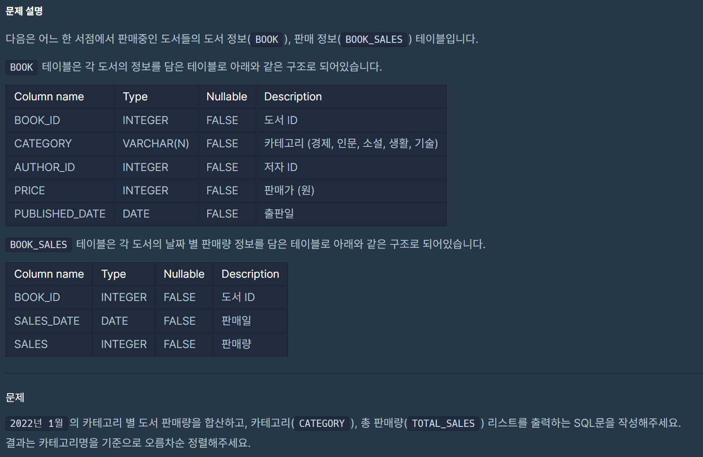

|번호|문제|
|---|-----| 
|1| [카테고리 별 도서 판매량 집계하기](# 1. 카테고리 별 도서 판매량 집계하기)  |
|2| [오랜 기간 보호한 동물(2)](#문제2)  |
|3| [대여 기록이 존재하는 자동차 리스트 구하기](#문제3)  |  
|4| [즐겨찾기가 가장 많은 식당 정보 출력하기](#문제4)  |  
|5| [없어진 기록 찾기](#문제5) | 
|6| [대장균의 크기에 따라 분류하기 1](#문제6) | 
|7| [자동차 대여 기록에서 대여중 / 대여 가능 여부 구분하기](#문제7) | 
|8| [헤비 유저가 소유한 장소](#문제8) | 
|9| [특정 조건을 만족하는 물고기별 수와 최대 길이 구하기](#문제9) | 
|10| [대장균들의 자식의 수 구하기](#문제10) | 
|11| [업그레이드 할 수 없는 아이템 구하기](#문제11) | 
|12| [물고기 종류 별 대어 찾기](#문제12) | 
|13| [대장균의 크기에 따라 분류하기 2](#문제13) | 

---

# 1. 카테고리 별 도서 판매량 집계하기
## lv3
## 날짜 : 2/9(SUN)
### 문제 링크 : [프로그래머스](https://school.programmers.co.kr/learn/courses/30/lessons/144855)



### 최종 코드
```
WITH B_S AS (
    SELECT 
        B.CATEGORY, 
        SUM(S.SALES) AS TOTAL_SALES
    FROM BOOK AS B
    JOIN BOOK_SALES AS S
    ON B.BOOK_ID = S.BOOK_ID
    WHERE S.SALES_DATE LIKE '2022-01%'
    GROUP BY B.CATEGORY
)
SELECT CATEGORY, TOTAL_SALES
FROM B_S
ORDER BY CATEGORY ASC;
```

# 2. 오랜 기간 보호한 동물(2)
## lv3
## 날짜 : 2/9(SUN)
### 문제 링크 : [프로그래머스](https://school.programmers.co.kr/learn/courses/30/lessons/59411)


### 최종 코드
```
