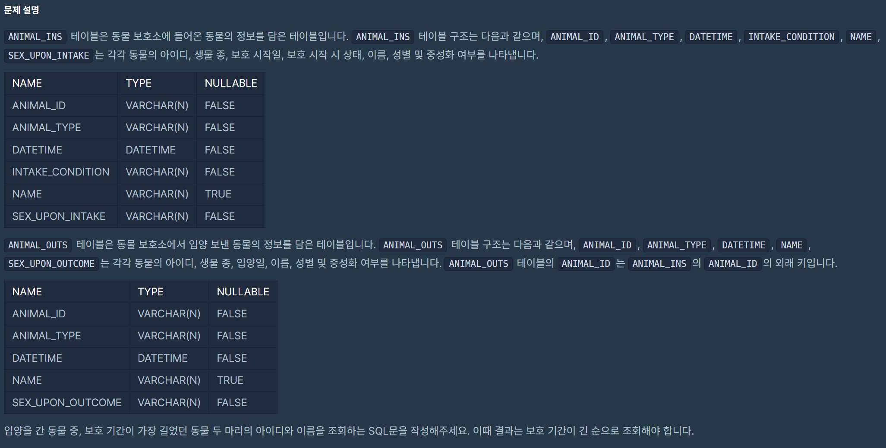
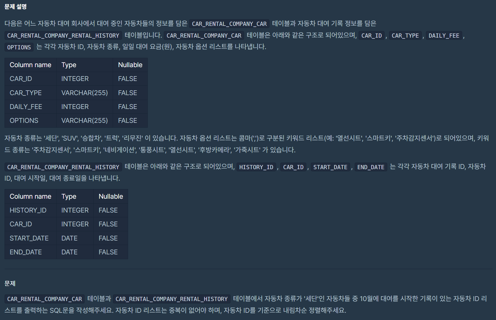
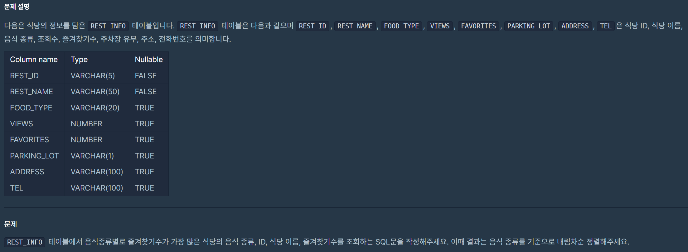
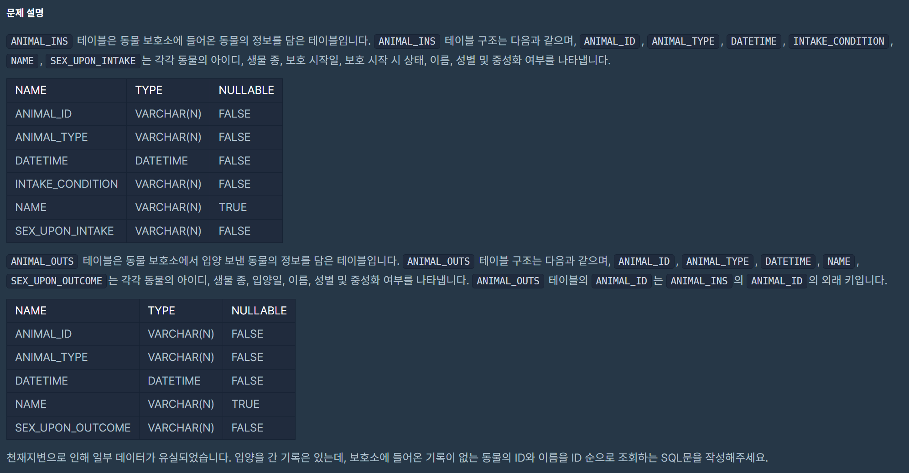
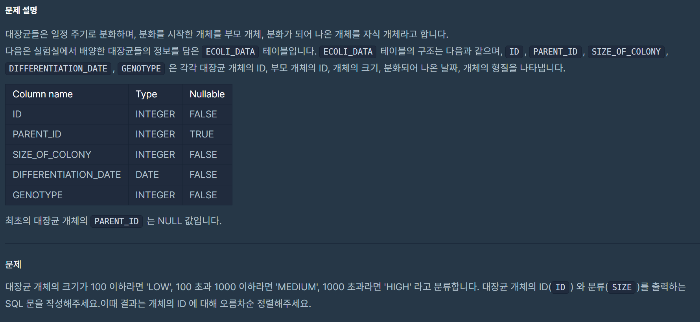
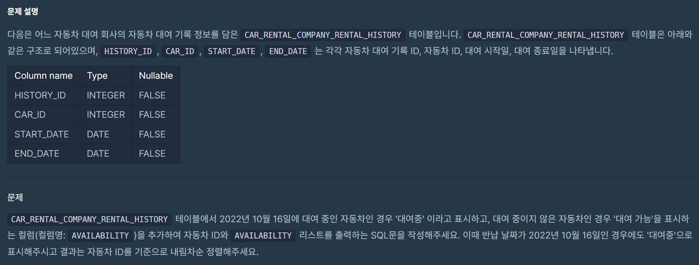
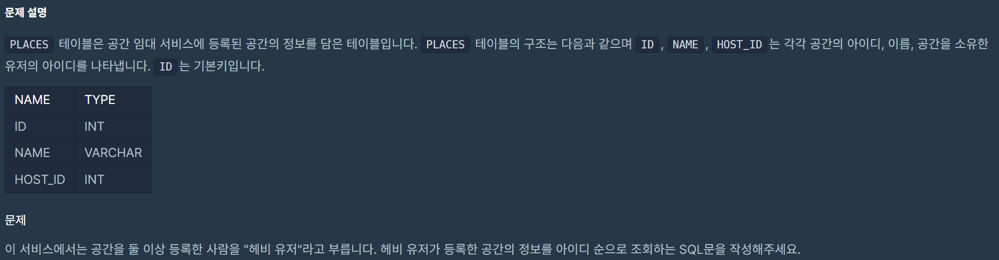
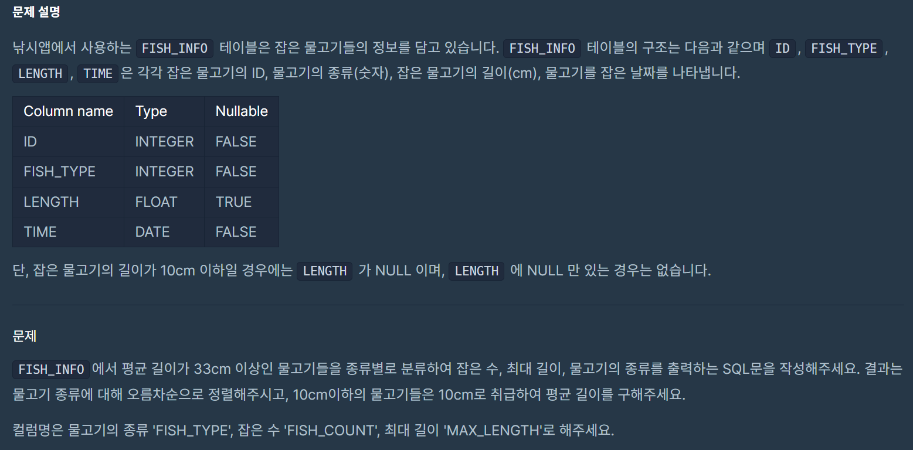
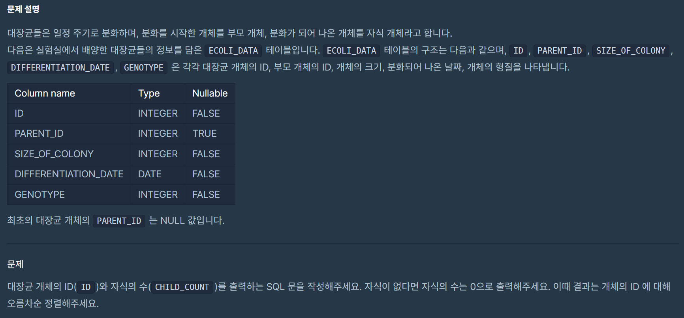

|번호|문제|
|---|-----| 
|1| [카테고리 별 도서 판매량 집계하기](#문제1)  |
|2| [오랜 기간 보호한 동물(2)](#문제2)  |
|3| [대여 기록이 존재하는 자동차 리스트 구하기](#문제3)  |  
|4| [즐겨찾기가 가장 많은 식당 정보 출력하기](#문제4)  |  
|5| [없어진 기록 찾기](#문제5) | 
|6| [대장균의 크기에 따라 분류하기 1](#문제6) | 
|7| [자동차 대여 기록에서 대여중 / 대여 가능 여부 구분하기](#문제7) | 
|8| [헤비 유저가 소유한 장소](#문제8) | 
|9| [특정 조건을 만족하는 물고기별 수와 최대 길이 구하기](#문제9) | 
|10| [대장균들의 자식의 수 구하기](#문제10) | 
|11| [업그레이드 할 수 없는 아이템 구하기](#문제11) | 
|12| [물고기 종류 별 대어 찾기](#문제12) | 
|13| [대장균의 크기에 따라 분류하기 2](#문제13) | 

---
# 문제1
## 1. 카테고리 별 도서 판매량 집계하기 (LV3)
## 날짜 : 2/9(SUN)
### 문제 링크 : [프로그래머스](https://school.programmers.co.kr/learn/courses/30/lessons/144855)


### 최종 코드
```
WITH B_S AS (
    SELECT 
        B.CATEGORY, 
        SUM(S.SALES) AS TOTAL_SALES
    FROM BOOK AS B
    JOIN BOOK_SALES AS S
    ON B.BOOK_ID = S.BOOK_ID
    WHERE S.SALES_DATE LIKE '2022-01%'
    GROUP BY B.CATEGORY
)
SELECT CATEGORY, TOTAL_SALES
FROM B_S
ORDER BY CATEGORY ASC;
```

# 문제2
## 2. 오랜 기간 보호한 동물(2) (LV3)
## 날짜 : 2/9(SUN)
### 문제 링크 : [프로그래머스](https://school.programmers.co.kr/learn/courses/30/lessons/59411)



### 최종 코드
```
SELECT
I.ANIMAL_ID,
I.NAME
FROM ANIMAL_INS AS I
RIGHT JOIN ANIMAL_OUTS AS O
ON I.ANIMAL_ID = O.ANIMAL_ID
ORDER BY DATEDIFF(O.DATETIME, I.DATETIME) DESC
LIMIT 2;
```

# 문제3
## 3. 대여 기록이 존재하는 자동차 리스트 구하기 (LV3)
## 날짜 : 2/10(MON)
### 문제 링크 : [프로그래머스](https://school.programmers.co.kr/learn/courses/30/lessons/157341)



### 최종 코드
```
SELECT DISTINCT
C.CAR_ID
FROM CAR_RENTAL_COMPANY_CAR AS C
JOIN CAR_RENTAL_COMPANY_RENTAL_HISTORY AS R
ON C.CAR_ID = R.CAR_ID
WHERE CAR_TYPE = '세단' AND MONTH(START_DATE) = '10'
ORDER BY C.CAR_ID DESC;
```

# 문제4
## 4. 즐겨찾기가 가장 많은 식당 정보 출력하기 (LV3)
## 날짜 : 2/10(MON)
### 문제 링크 : [프로그래머스](https://school.programmers.co.kr/learn/courses/30/lessons/131123)

저번 w4_15번 문제와 문제 풀이 방식이 비슷하다고 느꼈습니다! -> 서브 쿼리 활용



### 최종 코드
```
SELECT FOOD_TYPE, 
REST_ID, 
REST_NAME, 
FAVORITES
FROM REST_INFO AS RI1
WHERE FAVORITES = (
    SELECT MAX(FAVORITES)
    FROM REST_INFO AS RI2
    WHERE RI1.FOOD_TYPE = RI2.FOOD_TYPE
)
ORDER BY FOOD_TYPE DESC;
```

### 주의할 점
- 같은 FOOD_TYPE끼리 묶어서 처리, 비교해야 함.
-> ```WHERE RI1.FOOD_TYPE = RI2.FOOD_TYPE```

- WHERE FAVORITES = (서브쿼리 결과)를 통해 FAVORITES 값이 가장 큰 행만 남긴 것.

# 문제5
## 5. 없어진 기록 찾기 (LV3)
## 날짜 : 2/10(MON)
### 문제 링크 : [프로그래머스](https://school.programmers.co.kr/learn/courses/30/lessons/59042)



### 최종 코드
```
SELECT
O.ANIMAL_ID,
O.NAME
FROM ANIMAL_OUTS AS O
LEFT JOIN ANIMAL_INS AS I
ON O.ANIMAL_ID = I.ANIMAL_ID
WHERE I.ANIMAL_ID IS NULL
ORDER BY O.ANIMAL_ID ASC;
```

> Q. 왜 LEFT JOIN인지,, 사실 처음에 RIGHT JOIN했는데 결과가 아예 안나왔었걸랑요.


# 문제6
## 6. 대장균의 크기에 따라 분류하기 1 (LV3)
## 날짜 : 2/10(MON)
### 문제 링크 : [프로그래머스](https://school.programmers.co.kr/learn/courses/30/lessons/59042)



### 최종 코드
```
SELECT
ID,
CASE
WHEN SIZE_OF_COLONY > 1000 THEN 'HIGH'
WHEN SIZE_OF_COLONY > 100 AND SIZE_OF_COLONY <= 1000 THEN 'MEDIUM'
ELSE 'LOW'
END AS SIZE
FROM ECOLI_DATA
ORDER BY ID ASC;
```

# 문제7 ⭐
## 7. 자동차 대여 기록에서 대여중 / 대여 가능 여부 구분하기 (LV3)
## 날짜 : 2/10(MON)
### 문제 링크 : [프로그래머스](https://school.programmers.co.kr/learn/courses/30/lessons/157340)



### 최종 코드
```

```


### 시도했었던 코드
```
SELECT DISTINCT
CAR_ID,
CASE WHEN DATEDIFF('2022-10-16', END_DATE) >= 0
THEN '대여 가능'
ELSE '대여중'
END AS AVAILABILITY
FROM CAR_RENTAL_COMPANY_RENTAL_HISTORY
ORDER BY CAR_ID DESC;
```


# 문제8
## 8. 헤비 유저가 소유한 장소 (LV3)
## 날짜 : 2/10(MON)
### 문제 링크 : [프로그래머스](https://school.programmers.co.kr/learn/courses/30/lessons/77487)



### 최종 코드
```
SELECT
*
FROM PLACES
WHERE HOST_ID IN (
    SELECT HOST_ID
    FROM PLACES
    GROUP BY HOST_ID
    HAVING COUNT(*) >= 2)
ORDER BY ID
```

### 공부한 부분
> 왜 굳이 서브쿼리를 실행했어야 했나ㅏㅏ
```
SELECT *
FROM PLACES
GROUP BY HOST_ID
HAVING COUNT(*) >= 2
ORDER BY ID;
```
위 코드가 처음 실행했었던 코드인데요, 이렇게 실행을 하면
GROUP BY를 한 다음에 어떤 행을 반환해야할지 모른다하더라구요.
(왜냐면 SELECT * 이니까 -> 지정된 3칼럼 중 뭐가 기준인지 모름이슈슈)

따라서 일단 1차적으로 원하는 조건의 HOST_ID만을 GROUP BY를 통해서 불러오고 이걸 최종 쿼리에 넣어서 해당 HOST_ID의 모든 정보를 불러오는 것이 가능하다!!


# 문제9
## 9. 헤비 유저가 소유한 장소 (LV3)
## 날짜 : 2/10(MON)
### 문제 링크 : [프로그래머스](https://school.programmers.co.kr/learn/courses/30/lessons/77487)



### 최종 코드
```
SELECT
COUNT(*) AS FISH_COUNT,
MAX(IFNULL(LENGTH, 10)) AS MAX_LENGTH,
FISH_TYPE
FROM FISH_INFO
GROUP BY FISH_TYPE
HAVING AVG(IFNULL(LENGTH, 10)) >= 33
ORDER BY FISH_TYPE ASC;
```

# 문제10
## 10. 대장균들의 자식의 수 구하기 (LV3)
## 날짜 : 2/11(TUE)
### 문제 링크 : [프로그래머스](https://school.programmers.co.kr/learn/courses/30/lessons/299305)



### 최종 코드
```
SELECT
E1.ID,
COUNT(E2.ID) AS CHILD_COUNT
FROM ECOLI_DATA AS E1
LEFT JOIN ECOLI_DATA AS E2
ON E1.ID = E2.PARENT_ID
GROUP BY E1.ID
ORDER BY E1.ID ASC;
```

### 공부한 부분
- 처음에 그냥 JOIN으로 풀었을 때는 자식의 수가 0인 부모의 개체가 나타나지 않는 문제가 발생했는데, LEFT JOIN으로 하고 나니까 정답처리가 되더군요..흐음
```
JOIN 은 기본적으로 INNER JOIN을 의미한다.
따라서, 두 테이블 간의 공통된 값이 있는 행만 반환한다.
즉, ON 조건을 만족하는 데이터만 결과에 포함한다.

LEFT JOIN은 왼쪽 테이블의 모든 데이터를 유지하면서, 오른쪽 테이블에서 ON 조건을 만족하는 데이터를 가져오는 것.
이때 만약 오른쪽 테이블에 일치하는 값이 없다면 NULL로 채운다.

즉, PARENT_ID가 없는 ID(= 자식이 없는 개체)는 NULL이 되어 결과가 0으로 불러오게 된다.
```
- 또한 COUNT함수의 경우 NULL 값은 자동으로 0으로 처리하기 떄문에 굳이 ISNULL(, 0)처럼 식을 하나 더 써줄 필요가 없다는 사실을 알게 되었답니다.


# 문제11
## 11. 업그레이드 할 수 없는 아이템 구하기 (LV3)
## 날짜 : 2/11(TUE)
### 문제 링크 : [프로그래머스](https://school.programmers.co.kr/learn/courses/30/lessons/273712)


### 최종 코드
```
SELECT
I.ITEM_ID,
I.ITEM_NAME,
RARITY
FROM ITEM_INFO AS I
LEFT JOIN ITEM_TREE AS T
ON I.ITEM_ID = T.PARENT_ITEM_ID
WHERE T.PARENT_ITEM_ID IS NULL
ORDER BY I.ITEM_ID DESC;
```

# 문제12
## 12. 물고기 종류 별 대어 찾기 (LV3)
## 날짜 : 2/11(TUE)
### 문제 링크 : [프로그래머스](https://school.programmers.co.kr/learn/courses/30/lessons/293261)


### 최종 코드
```
SELECT
I.ID,
N.FISH_NAME,
I.LENGTH
FROM FISH_INFO AS I
JOIN FISH_NAME_INFO AS N
ON I.FISH_TYPE = N.FISH_TYPE
WHERE I.FISH_TYPE IN (SELECT FISH_TYPE 
                      FROM FISH_INFO 
                      GROUP BY FISH_TYPE
                      HAVING LENGTH = MAX(LENGTH))
ORDER BY I.ID ASC;
```

### 주의해야 할 부분
처음에 서브 쿼리 만들 때 I.FISH_TYPE IN (SELECT I.FISH_TYPE 어쩌구)
이런 식으로 썼는데, 아무래도 서브쿼리 안에서는 따로 별칭을 지정하지 않았으므로 그냥 FISH_TYPE으로 쓰는 게 맞더라구요! 주의주의~


# 문제13
## 13. 대장균의 크기에 따라 분류하기 2 (LV3) ⭐
## 날짜 : 2/11(TUE)
### 문제 링크 : [프로그래머스](https://school.programmers.co.kr/learn/courses/30/lessons/301649)


### 최종 코드
```
SELECT
    A.ID,
    CASE
        WHEN A.PERCENT <= 0.25 THEN 'CRITICAL'
        WHEN A.PERCENT <= 0.5 THEN 'HIGH'
        WHEN A.PERCENT <= 0.75 THEN 'MEDIUM'
        ELSE 'LOW'
    END AS COLONY_NAME
FROM (
    SELECT
        ID,
        PERCENT_RANK() OVER (ORDER BY SIZE_OF_COLONY DESC) AS PERCENT
    FROM ECOLI_DATA
) AS A
ORDER BY A.ID;
```

### 공부한 부분
여기서 사용하는 PERCENT_RANK() 함수는 윈도우 함수로 SELECT 절에서만 사용할 수 있다.
따라서, 윈도우 함수의 결과를 CASE 문에 쓰기 위해서는 서브쿼리를 먼저 계산해주는 것이 필연적이다.

-> PERCENT_RANK() : 크기가 큰 대장균부터 작은 대장균까지 백분위수를 계산한다.

# 문제14
## 14. 식품분류별 가장 비싼 식품의 정보 조회하기 (LV4)
## 날짜 : 2/11(TUE)
### 문제 링크 : [프로그래머스](https://school.programmers.co.kr/learn/courses/30/lessons/131116)


### 최종 코드
```
SELECT
CATEGORY,
PRICE AS MAX_PRICE,
PRODUCT_NAME
FROM FOOD_PRODUCT
WHERE PRICE IN (
SELECT MAX(PRICE)
FROM FOOD_PRODUCT
GROUP BY CATEGORY)
AND CATEGORY IN ('과자', '국', '김치', '식용유')
ORDER BY PRICE DESC;
```


# 문제15
## 15. 5월 식품들의 총매출 조회하기 (LV4)
## 날짜 : 2/11(TUE)
### 문제 링크 : [프로그래머스](https://school.programmers.co.kr/learn/courses/30/lessons/131117)


### 최종 코드
```
SELECT
    P.PRODUCT_ID,
    PRODUCT_NAME,
    SUM(PRICE * AMOUNT) AS TOTAL_SALES
FROM FOOD_PRODUCT P
JOIN FOOD_ORDER O ON P.PRODUCT_ID = O.PRODUCT_ID
WHERE PRODUCE_DATE LIKE '2022-05%'
GROUP BY PRODUCT_NAME
ORDER BY TOTAL_SALES DESC, PRODUCT_ID;
```