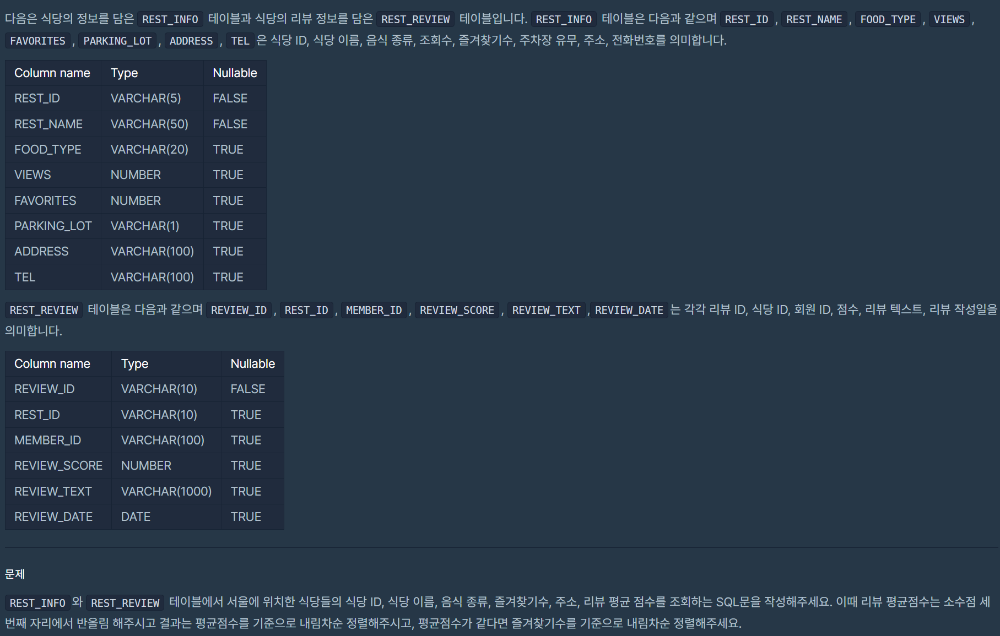
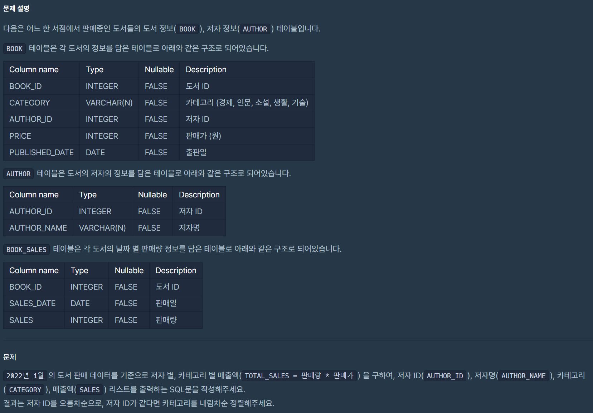
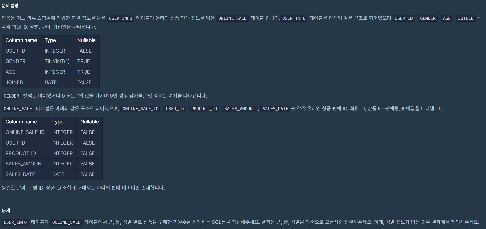
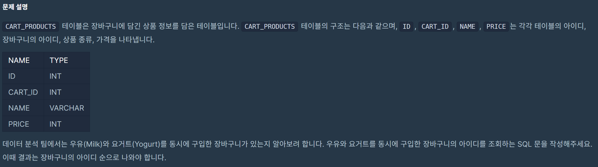
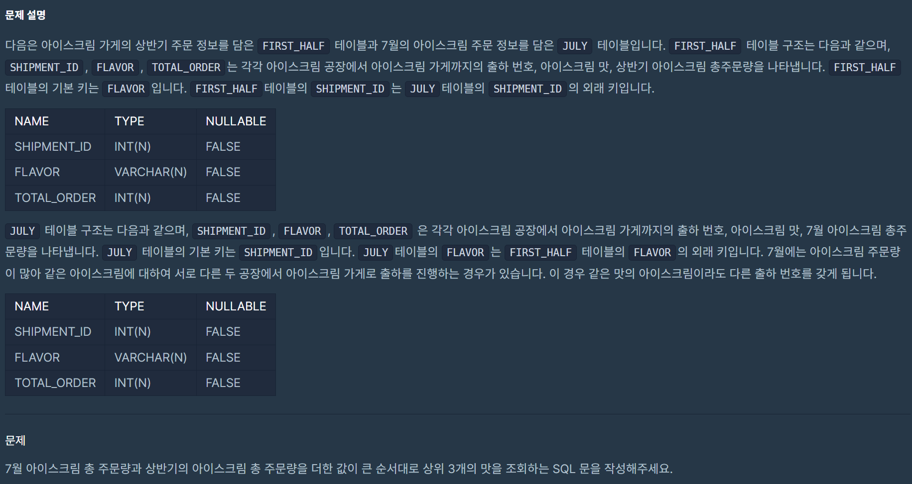
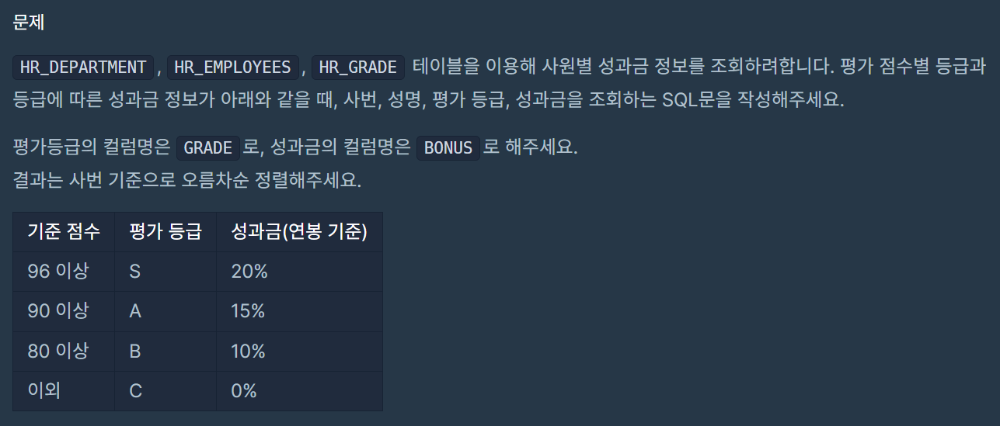

|번호|문제|
|---|-----| 
|1| [서울에 위치한 식당 목록 출력하기](#문제1)  |
|2| [저자 별 카테고리 별 매출액 집계하기](#문제2)  |
|3| [년, 월, 성별 별 상품 구매 회원 수 구하기](#문제3)  |  
|4| [우유와 요거트가 담긴 장바구니](#문제4)  |  
|5| [주문량이 많은 아이스크림들 조회하기](#문제5) | 
|6| [연간 평가점수에 해당하는 평가 등급 및 성과금 조회하기](#문제6) | 
|7| [그룹별 조건에 맞는 식당 목록 출력하기](#문제7) | 
|8| [상품을 구매한 회원 비율 구하기](#문제8) | 

<BR>

---
# 문제1
## 1. 서울에 위치한 식당 목록 출력하기 (LV4)
## 날짜 : 2/16(SUN)
### 문제 링크 : [프로그래머스](https://school.programmers.co.kr/learn/courses/30/lessons/131118)



### 최종 코드
```
SELECT
I.REST_ID,
I.REST_NAME,
I.FOOD_TYPE,
I.FAVORITES,
I.ADDRESS,
ROUND(AVG(R.REVIEW_SCORE), 2) AS SCORE
FROM REST_INFO AS I
JOIN REST_REVIEW AS R
ON I.REST_ID = R.REST_ID
WHERE ADDRESS LIKE '서울%'
GROUP BY I.REST_ID 
ORDER BY SCORE DESC, FAVORITES DESC;
```
<BR>

# 문제2
## 2. 저자 별 카테고리 별 매출액 집계하기 (LV4)
## 날짜 : 2/16(SUN)
### 문제 링크 : [프로그래머스](https://school.programmers.co.kr/learn/courses/30/lessons/131118)



### 최종 코드
```
SELECT
B.AUTHOR_ID,
A.AUTHOR_NAME,
CATEGORY,
SUM(PRICE*SALES) AS TOTAL_SALES
FROM BOOK AS B
JOIN AUTHOR AS A
ON B.AUTHOR_ID = A.AUTHOR_ID
JOIN BOOK_SALES AS S
ON B.BOOK_ID = S.BOOK_ID
WHERE DATE_FORMAT(SALES_DATE, '%Y-%m') = '2022-01'
GROUP BY B.AUTHOR_ID, CATEGORY
ORDER BY B.AUTHOR_ID ASC, CATEGORY DESC;
```

# 문제3
## 3. 년, 월, 성별 별 상품 구매 회원 수 구하기 (LV4)
## 날짜 : 2/16(SUN)
### 문제 링크 : [프로그래머스](https://school.programmers.co.kr/learn/courses/30/lessons/131532)



### 최종 코드
```
SELECT
YEAR(SALES_DATE) AS YEAR,
MONTH(SALES_DATE) AS MONTH,
GENDER,
COUNT(DISTINCT(I.USER_ID)) AS USERS
FROM USER_INFO AS I
JOIN ONLINE_SALE AS O
ON I.USER_ID = O.USER_ID
WHERE GENDER IS NOT NULL
GROUP BY YEAR, MONTH, GENDER
ORDER BY YEAR, MONTH, GENDER
```

### 처음 시도했었던 코드
```
SELECT DISTINCT
YEAR(SALES_DATE) AS YEAR,
MONTH(SALES_DATE) AS MONTH,
GENDER,
COUNT(I.USER_ID) AS USERS
FROM USER_INFO AS I
JOIN ONLINE_SALE AS O
ON I.USER_ID = O.USER_ID
WHERE GENDER IS NOT NULL
GROUP BY YEAR, MONTH, GENDER
ORDER BY YEAR, MONTH, GENDER
```

### 피드백
처음 시도했었던 코드처럼 쓰면 저번 스터디 때도 말했듯이 ```YEAR, MONTH, GENDER, COUNT(I.USER_ID)``` 조합이 같은 경우에만 한 행으로 남게 되므로 제대로 중복을 제거해주기엔 제한이 있다. 우리가 원하는 건 년, 월, 성별별 고유 사용자의 수 이므로 ```COUNT(DISTINCT I.USER_ID)```를 사용해서 중복된 사용자 ID를 제외하고 고유한 사용자 수만 계산해야 한다.


# 문제4
## 4. 우유와 요거트가 담긴 장바구니 (LV4)
## 날짜 : 2/16(SUN)
### 문제 링크 : [프로그래머스](https://school.programmers.co.kr/learn/courses/30/lessons/62284)



### 최종 코드
```
WITH MILK_CART AS (
SELECT
CART_ID
FROM CART_PRODUCTS
WHERE NAME = 'Milk'),

YOGURT_CART AS (
SELECT
CART_ID
FROM CART_PRODUCTS
WHERE NAME = 'Yogurt')

SELECT
M.CART_ID
FROM MILK_CART AS M
JOIN YOGURT_CART AS Y
ON M.CART_ID = Y.CART_ID
GROUP BY M.CART_ID
ORDER BY M.CART_ID ASC;
```

# 문제5 
## 5. 주문량이 많은 아이스크림들 조회하기 (LV4) ⭐
## 날짜 : 2/16(SUN)
### 문제 링크 : [프로그래머스](https://school.programmers.co.kr/learn/courses/30/lessons/133027)



### 최종 코드
```
SELECT
F.FLAVOR
FROM FIRST_HALF AS F
JOIN JULY AS J
ON F.FLAVOR = J.FLAVOR
GROUP BY J.FLAVOR
ORDER BY SUM(F.TOTAL_ORDER + J.TOTAL_ORDER) DESC
LIMIT 3;
```

### 그냥 시도했었던 코드
```
SELECT
F.FLAVOR
FROM FIRST_HALF AS F
RIGHT JOIN JULY AS J
ON F.SHIPMENT_ID = J.SHIPMENT_ID
GROUP BY J.FLAVOR
ORDER BY F.TOTAL_ORDER + J.TOTAL_ORDER DESC
LIMIT 3;
```

- JOIN 키 : FLAVOR로 설정
    - 당연함. 문제에서 ```'JULY테이블의 FLAVOR는 FIRST_HALF 테이블의 FLAVOR의 외래 키입니다.'```라고 제시되어있음... 아무래도~^^

- SUM(F.TOTAL_ORDER + J.TOTAL_ORDER)..즉, SUM을 추가해줌.
    - 문제에서 제시한 ```'7월에는 아이스크림 주문량이 많아 같은 아이스크림에 대하여 서로 다른 두 공장에서 출하하는 경우가 있음.'``` 이 부분이 말하고자 하는 바가 이거였음..
    - 즉, JULY 테이블에서는 같은 FLAVOR가 여러 행에 걸쳐 존재할 수 있으며 1) JOIN할 때 FLAVOR를 기준으로 해야하며, TOTAL_ORDER를 그룹화(SUM)하여 같은 FLAVOR의 전체 주문량을 구해야한다..!!
    - 이렇게 함으로써 같은 FLAVOR를 가진 여러 SHIPMENT_ID의 주문량을 합칠 수 있음~!


# 문제6
## 6. 연간 평가점수에 해당하는 평가 등급 및 성과금 조회하기 (LV4) ⭐
## 날짜 : 2/16(SUN)
### 문제 링크 : [프로그래머스](https://school.programmers.co.kr/learn/courses/30/lessons/284528)



### 최종 코드
```

```