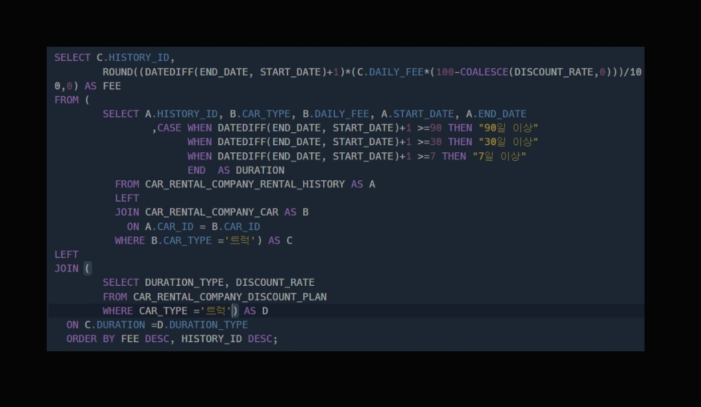

|번호|문제|
|---|-----| 
|1| [오프라인/온라인 판매 데이터 통합하기](#문제1)  |
|2| [입양 시각 구하기(2)](#문제2)  |
|3| [특정 세대의 대장균 찾기](#문제3)  |  
|4| [자동차 대여 기록 별 대여 금액 구하기](#문제4)  |  
|5| [FrontEnd 개발자 찾기](#문제5) | 
|6| [특정 기간동안 대여 가능한 자동차들의 대여비용 구하기](#문제6) | 
|7| [언어별 개발자 분류하기](#문제7) | 
|8| [멸종위기의 대장균 찾기](#문제8) | 

<BR>

---
# 문제1
## 1. 오프라인/온라인 판매 데이터 통합하기 (LV4)
## 날짜 : 2/24(MON)
### 문제 링크 : [프로그래머스](https://school.programmers.co.kr/learn/courses/30/lessons/131537)


### 최종 코드
```
SELECT 
    DATE_FORMAT(SALES_DATE, '%Y-%m-%d') AS SALES_DATE,
    PRODUCT_ID,
    USER_ID,
    SALES_AMOUNT
FROM ONLINE_SALE
WHERE SALES_DATE LIKE '2022-03%'

UNION ALL

SELECT 
    DATE_FORMAT(SALES_DATE, '%Y-%m-%d'),
    PRODUCT_ID,
    NULL AS USER_ID,  -- 오프라인 판매는 USER_ID가 없으므로 NULL 처리
    SALES_AMOUNT
FROM OFFLINE_SALE
WHERE SALES_DATE LIKE '2022-03%'

ORDER BY SALES_DATE, PRODUCT_ID, USER_ID;
```

### 처음 시도했었던 코드
```
SELECT
DATE_FORMAT(N.SALES_DATE, '%Y-%m-%d') AS SALES_DATE,
N.PRODUCT_ID,
COALESCE(N.USER_ID, NULL) AS USER_ID,
N.SALES_AMOUNT
FROM ONLINE_SALE AS N
JOIN OFFLINE_SALE AS F
USING (PRODUCT_ID)
WHERE DATE_FORMAT(N.SALES_DATE, '%Y-%m-%d') LIKE '2022-03%'
ORDER BY SALES_DATE ASC, N.PRODUCT_ID ASC, N.USER_ID ASC
```

처음에는 JOIN만 쓸 생각..이었는데 UNION ALL 이라는 혁명적인(?) 방법을 찾아냄!(지선생님이..^^)

<BR>

# 문제2
## 2. 입양 시각 구하기(2) (LV4) ⭐
## 날짜 : 2/24(MON)
### 문제 링크 : [프로그래머스](https://school.programmers.co.kr/learn/courses/30/lessons/59413)


### 최종 코드
```
WITH RECURSIVE HT AS (
SELECT 
0 AS HOUR
UNION ALL
SELECT HOUR +1 FROM HT WHERE HOUR<23)

SELECT
HT.HOUR,
COALESCE(COUNT(O.ANIMAL_ID), 0) AS COUNT
FROM HT
LEFT JOIN ANIMAL_OUTS AS O
ON HT.HOUR = HOUR(O.DATETIME)
GROUP BY HT.HOUR
ORDER BY HT.HOUR ASC;
```

### 처음 시도했었던 코드
```
SELECT
HOUR(DATETIME) AS HOUR,
COUNT(ANIMAL_ID) AS COUNT
FROM ANIMAL_OUTS
GROUP BY HOUR(DATETIME)
ORDER BY HOUR ASC
```
근데 이렇게 돌리면 값이 없는 즉, 0~6 & 20~23 시에 대한 칸은 0이라고 출력돼야 하는데 이부분 코드가 없는 게 이슈!(역시 괜히 LV4가 아니어따따)

- 일반적으로 WITH문의 경우 WITH문에 대한 정의가 다 끝났을 때 호출이 가능.
- BUT, RECURSIVE의 경우는 다르다! 이건 자기 자신을 호출하면서 데이터를 확장하는 구조다.
- 처음에 초깃값을 설정(SELECT 0 AS HOUR -> HOUR=0인 데이터가 초깃값)한 후,
UNION ALL 뒤의 함수식을 계속 적용하여 재귀-호출하면서 데이터 확장 ㅆㄱㄴ!

<BR>

# 문제3
## 3. 특정 세대의 대장균 찾기 (LV4)
## 날짜 : 2/24(MON)
### 문제 링크 : [프로그래머스](https://school.programmers.co.kr/learn/courses/30/lessons/301650)


### 최종 코드 (SOL1)
```
SELECT F.ID
FROM ECOLI_DATA AS F
JOIN ECOLI_DATA AS S ON F.PARENT_ID = S.ID
JOIN ECOLI_DATA AS T ON S.PARENT_ID = T.ID
WHERE T.PARENT_ID IS NULL
ORDER BY F.ID ASC
```

### 최종 코드 (SOL2)
```
SELECT ID
FROM ECOLI_DATA
WHERE PARENT_ID IN (
SELECT ID
FROM ECOLI_DATA
WHERE PARENT_ID IN (
    SELECT ID
    FROM ECOLI_DATA
    WHERE PARENT_ID IS NULL
))
ORDER BY ID;
```

<BR>

# 문제4
## 4. 자동차 대여 기록 별 대여 금액 구하기 (LV4) ⭐
## 날짜 : 2/24(MON)
### 문제 링크 : [프로그래머스](https://school.programmers.co.kr/learn/courses/30/lessons/151141)


### 최종 코드
```
SELECT C.CAR_ID as CAR_ID,
       C.CAR_TYPE as CAR_TYPE,
       ROUND(C.DAILY_FEE*30*(100-P.DISCOUNT_RATE)/100) AS FEE
    FROM CAR_RENTAL_COMPANY_CAR C
    JOIN CAR_RENTAL_COMPANY_RENTAL_HISTORY H ON C.CAR_ID = H.CAR_ID
    JOIN CAR_RENTAL_COMPANY_DISCOUNT_PLAN P ON C.CAR_TYPE = P.CAR_TYPE
    WHERE C.CAR_ID NOT IN ( 
        SELECT CAR_ID
        FROM CAR_RENTAL_COMPANY_RENTAL_HISTORY
        WHERE END_DATE >= '2022-11-01' AND START_DATE <= '2022-12-01'
) AND P.DURATION_TYPE LIKE '30%'
GROUP BY C.CAR_ID
HAVING C.CAR_TYPE IN ('세단', 'SUV') 
AND (FEE >= 500000 AND FEE < 2000000)
ORDER BY FEE DESC, CAR_TYPE, CAR_ID DESC;

```


# 문제5
## 5. FrontEnd 개발자 찾기 (LV4)
## 날짜 : 2/25(TUE)
### 문제 링크 : [프로그래머스](https://school.programmers.co.kr/learn/courses/30/lessons/276035)


### 최종 코드
```
SELECT DISTINCT
ID,
EMAIL,
FIRST_NAME,
LAST_NAME
FROM DEVELOPERS AS D
JOIN SKILLCODES AS S
ON S.CODE = S.CODE & D.SKILL_CODE
WHERE S.CATEGORY LIKE 'FRONT%'
ORDER BY ID;
```

# 문제6
## 6. 특정 기간동안 대여 가능한 자동차들의 대여비용 구하기 (LV4)
## 날짜 : 2/25(TUE)
### 문제 링크 : [프로그래머스](https://school.programmers.co.kr/learn/courses/30/lessons/157339)



### 최종 코드
```

```

# 문제7
## 7. 언어별 개발자 분류하기 (LV4)
## 날짜 : 2/25(TUE)
### 문제 링크 : [프로그래머스](https://school.programmers.co.kr/learn/courses/30/lessons/276036)


### 최종 코드
```
WITH FRONT AS ( SELECT SUM(CODE) FROM SKILLCODES WHERE CATEGORY = 'Front End' ) 
SELECT 
CASE WHEN SKILL_CODE & (SELECT * FROM FRONT) AND SKILL_CODE & (SELECT CODE FROM SKILLCODES WHERE NAME = 'python') THEN 'A' 
WHEN SKILL_CODE & (SELECT CODE FROM SKILLCODES WHERE NAME = 'C#') THEN 'B' 
WHEN SKILL_CODE & (SELECT * FROM FRONT) THEN 'C' 
END AS `GRADE`, ID, EMAIL 
FROM DEVELOPERS HAVING GRADE IS NOT NULL 
ORDER BY GRADE, ID;
```

# 문제8
## 8. 멸종위기의 대장균 찾기 (LV4) ⭐⭐⭐⭐⭐
## 날짜 : 2/25(TUE)
### 문제 링크 : [프로그래머스](https://school.programmers.co.kr/learn/courses/30/lessons/301651)


### 최종 코드
```
WITH RECURSIVE GenerationCTE AS (
    SELECT ID,PARENT_ID,1 AS Generation
    FROM ECOLI_DATA
    WHERE PARENT_ID IS NULL
    
    UNION ALL
    
    SELECT e.ID,e.PARENT_ID, g.Generation + 1 AS Generation
    FROM ECOLI_DATA e
    JOIN GenerationCTE g ON e.PARENT_ID = g.ID
)
SELECT ID
FROM GenerationCTE
WHERE Generation = 3
ORDER BY ID;
```
이거슨 필사....죄송죄송..